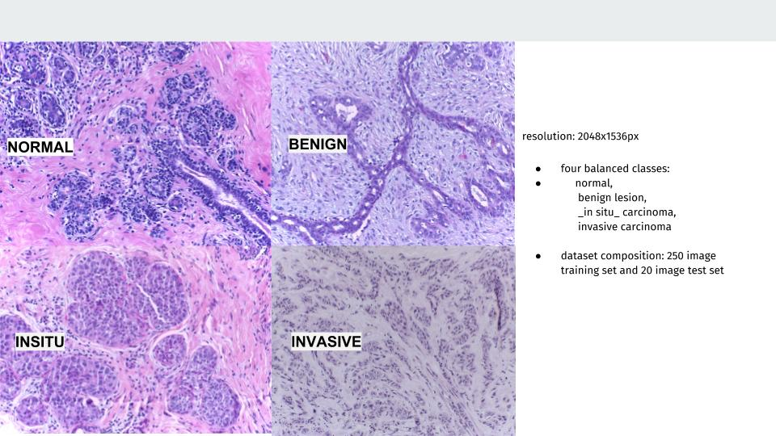
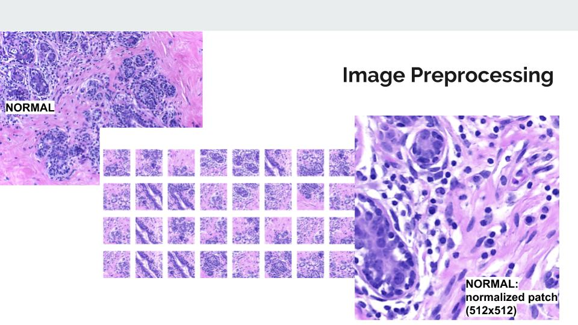
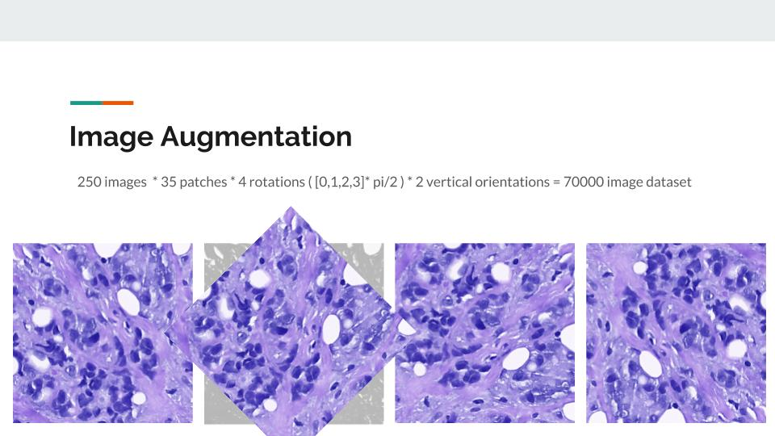
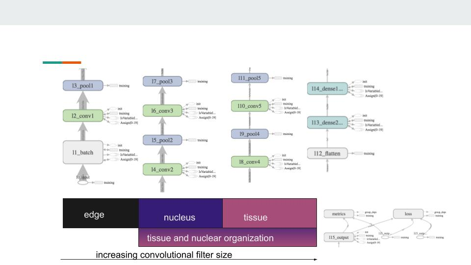

##### Project Statement / DS Question:
* Can a Convolutional Neural Network (ConvNet) be used to identify malignant cancer from histopathology slides? How can the ConvNet be interpreted?

The deep learning abilities of Convolutional Neural Networks have proven to be a boon to many industries, from facial recognition in security to self-driving automobiles. Convolutional Neural Networks differ from traditional feed-forward neural networks in that they feature 'convolutional' and 'pooling' layers. The convolutional layer applies a mathematical transformation to the output of the previous node, based on a certain piece of the image, denoted by the filter size. The convolved features are then pooled to provide parameters for the model. The model then selects features to use to classify images. However, the 

The dataset used in this capstone was breast cancer histology slides, classified into 4 classes by 2 different pathology teams.
>http://journals.plos.org/plosone/article?id=10.1371/journal.pone.0177544s

    - resolution: 2040x1536px
    - from _BioImaging 2015 breast histology classification challenge_
    - four balanced classes: 
                normal, 
                benign lesion, 
                _in situ_ carcinoma, 
                invasive carcinoma 
    - dataset composition: 250 image training set and 20 image test set

Since the training set of this data contained only 250 samples, image augmentation and patches were considered. Each one of the 2048x1536px images were divided into patches of 512x512 squaresm to be fed into the neural network.

Next, the patches were augmented, using `ImageDataGenerator` in keras. This allowed for patches rotated at 0, 90, 270, 180 degrees, as well as vertically and horizontally. Since histology images are graded in an orientation agnositic manner, the augmented patches retained their classifications. The augmentation expanded the 250 image dataset to 70,000 patches.

#### Convolutional Neural Net Architecture

The architecture of the network was designed to train on different aspects of the tissue sample from edges for cellular membranes to nuclear arraingement.

0. Input... 512,512,3  ...(BatchNormalization layer?) 
    --> https://arxiv.org/pdf/1502.03167.pdf 
        "BatchNormalization: Acc. Deep Network Training by Reducing Internal Covariate Shift"
1.      BATCHNORMALIZATION
2. Conv ... 510,510,16 ... 3x3 valid  --> relu

3. MP   ... 170,170,16 ... 3x3 valid
4. Conv ... 168,168,32 ... 3x3 valid  --> relu
5. MP   ... 84,84,32   ... 2x2 valid
6. Conv ... 84,84,64   ... 3x3 same   --> relu
7. MP   ... 42,42,64   ... 2x2 valid 
8. Conv ... 42,42,64   ... 3x3 same   --> relu
9. MP   ... 14,14,64   ... 3x3 valid
10. Conv ... 12,12,32  ... 3x3 valid  --> relu
11. MP  ... 12,12,32   ... 3x3 valid
12.    FLATTEN
13. FC  ... 256
14. FC  ... 128
15. FC  ... 4                         --> softmax

The next steps in this project are to investigate the mechanism of the CNN using LIME.
